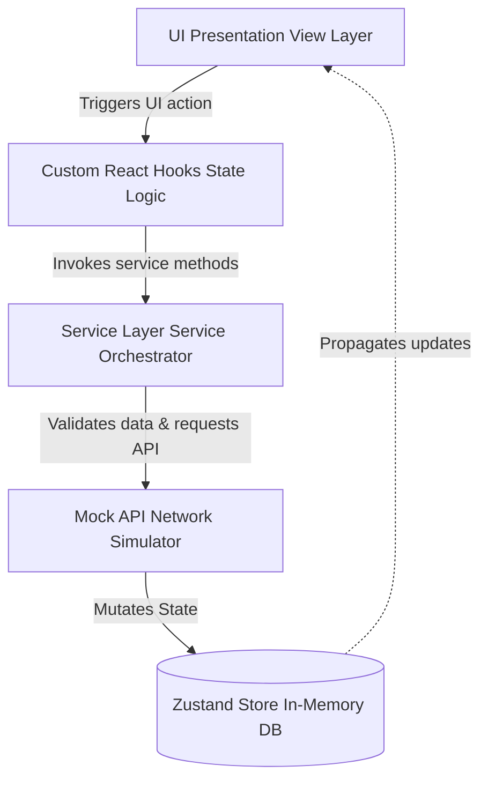
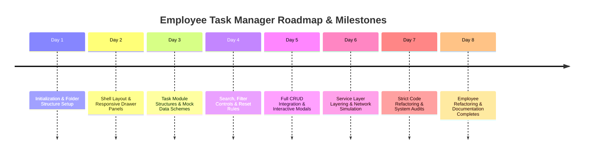
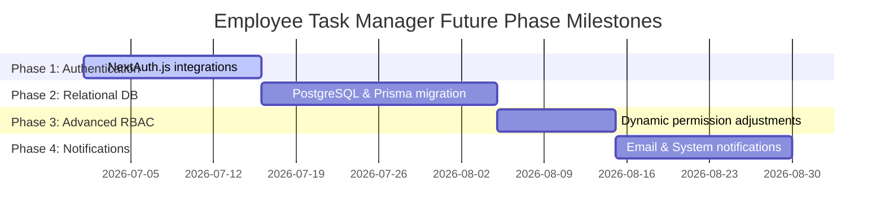

# Employee Task Manager

## Executive Summary

The **Employee Task Manager** is a CEO-ready, enterprise-grade SaaS platform designed to bridge the gap between workforce tracking and task execution. Developed as a high-fidelity workspace, this application addresses the operational overhead commonly experienced by fast-growing organizations that rely on fragmented tools. Rather than managing personnel profiles and team deliverables across separate, disconnected silos (such as spreadsheet directories and ticket trackers), this project provides a unified portal that tracks employee directory records alongside real-time task allocations.

### Business Problem Solved
1. **Operational Blindspots**: Managers lack immediate visibility into employee task capacities, leading to work imbalances or idle periods.
2. **Context-Switching Overhead**: Combining organizational charts, departmental directories, and daily task trackers into disparate interfaces degrades manager and staff productivity.
3. **Audit and Compliance Risks**: Enterprises lack a unified log of profile adjustments, task handoffs, and RBAC level updates.

### Expected Users
* **Executives & CEOs**: To review high-level company metrics, audit trails, and departmental performance.
* **HR & Operations Managers**: To maintain the central employee database, manage job roles, and inspect department alignment.
* **Team Leads & Managers**: To assign, prioritize, edit, and track status parameters of tasks.
* **Employees**: To view assigned tasks, update completion states, and track historical career events.

### Long-Term Vision
The platform aims to evolve into a fully self-hosted or cloud-native ERP module. Future releases will transition the existing mock API layer into a real-time NestJS or Go microservices backend backed by a PostgreSQL database and Prisma ORM, utilizing WebSockets for concurrent workspace updates.

---

## Project Goals

* **Task Management**: Empower managers to handle the entire lifecycle of task management (creation, allocation, state updates, priority tuning, duplication, and cancellation) through an intuitive UI.
* **Employee Management**: Provide a complete workspace containing searchable employee cards, contact directories, job status metrics, and detailed career timeline panels.
* **Team Management**: Allow managers to cluster resources under specific team scopes to improve task routing and resource allocation.
* **Department Management**: Establish a structured organization of departments (e.g., Engineering, Marketing, HR) to structure permissions and reporting lines.
* **Reporting & Auditing**: Maintain an append-only audit trail capturing key resource events (e.g., `EMPLOYEE_DEACTIVATED`, `TASK_ASSIGNED`) for executive reviews.
* **Role-Based Access Control (RBAC)**: Support a strict, frontend-gated permission architecture covering roles from `SUPER_ADMIN` to `VIEWER`.
* **Multilingual & Inclusive Design**: Fully support translation frameworks spanning English (LTR) and Arabic (RTL) locales, along with adaptive light/dark visual styling modes.

---

## Technology Stack

| Technology | Purpose | Why It Was Chosen |
| :--- | :--- | :--- |
| **Next.js (App Router)** | Core Application Framework | Provides page routing configurations, optimization pipelines, and layout structures suited for complex dashboard layouts. |
| **TypeScript** | Strict Programming Typing | Prevents production run-time bugs and errors by enforcing compile-time type-safety across stores, forms, and services. |
| **Tailwind CSS** | Premium Layout Customization | Offers immediate, atomic-class utility scaling, clean animations, and responsive breakpoints without bloated custom CSS sheets. |
| **Shadcn UI** | Presentation Component Base | Provides accessible, unstyled primitives (Dialogs, Menus, Selects) that can be styled manually to fit enterprise aesthetics. |
| **Zustand** | Centralized Client State Management | Extremely lightweight and performant state library. Easily persists mocked relational tables (employees, tasks, logs) across client routes. |
| **Zod** | Data Validation Engine | Standardizes incoming form payloads at both the UI and service layers, preventing malformed mutations. |
| **PostgreSQL** (Future) | Relational Database Store | Highly robust, ACID-compliant storage capable of tracking complex foreign keys, department bounds, and audit tables. |
| **Prisma ORM** (Future) | Type-Safe Database Connection | Automates PostgreSQL database migrations and auto-generates TypeScript client definitions matching database schemas. |

---

## Project Architecture Overview

To avoid the pitfalls of monolithic structures where business rules are directly coupled with page UI nodes, the application is built using a **Feature-Based Architecture**.



### Architectural Layers
1. **UI Presentation View Layer**: Contains thin, presentational components (e.g., `EmployeeTable`, `TaskCard`) focused strictly on markup, accessibility, and styling.
2. **Custom Hooks State Logic**: Hooks like `useEmployees` or `useTasks` manage UI states (search terms, active page, modal toggles) and connect the UI to service layers.
3. **Service Layer Service Orchestrator**: Acts as the business gatekeeper. It validates inputs via Zod and coordinates CRUD operations.
4. **API Network Simulator**: Emulates RESTful API endpoints. It introduces random networks delays (500ms - 1500ms) and maps request payloads to the database store.
5. **Zustand In-Memory Database**: Holds data tables representing future database states.

### Architectural Benefits
* **Scalability**: New modules (e.g., `Projects` or `Departments`) can be added without modifying existing code directories.
* **Maintainability**: Clear separation of concerns means visual changes (Tailwind classes) do not affect core business calculations.
* **Reusability**: Hooks and API handlers are decoupled from specific UI routes, allowing them to be shared across pages and drawers.
* **Team Collaboration**: Developers can work on components, schemas, or hooks in parallel without merge conflicts.

---

## Folder Structure

```
src/
├── app/                  # NEXT.JS ROUTING & LAYOUT VIEWS
│   ├── audit-logs/       # View route for tracking system audit logs
│   ├── dashboard/        # Executive overview panel mounting analytics KPI cards
│   ├── employees/        # Directory directory view and timeline drawers
│   ├── tasks/            # Task list, kanban-style columns, and detail views
│   ├── globals.css       # Core design tokens and tailwind style directives
│   └── layout.tsx        # Shell layout structure containing navigation and menus
├── components/           # APP-WIDE PRESENTATIONAL UI
│   ├── rbac/             # ProtectedRoute gate elements and testing role switchers
│   └── ui/               # Lower-level design building blocks (buttons, inputs)
├── config/               # RBAC AND SECURITY CONFIGURATION SETTINGS
│   └── rbac.ts           # Permission grids for roles (SUPER_ADMIN, ADMIN, etc.)
├── features/             # FEATURING LOGIC BOUND IN BUSINESS MODULES
│   ├── employees/        # Isolated Employee feature folder
│   │   ├── components/   # Skeletons, filters, grids, modals, and drawers
│   │   ├── constants/    # Status presets and query bounds
│   │   ├── hooks/        # custom hooks (useEmployees, useEmployeeCrud, useEmployeeApi)
│   │   ├── services/     # Mock data mutation handlers and services
│   │   ├── types/        # Type definitions for profile events
│   │   └── validation/   # Zod validation schemas
│   └── tasks/            # Isolated Task feature folder (mirrors Employees structure)
├── hooks/                # UNIVERSAL REACT HOOKS
│   └── useTranslation.ts # LTR/RTL translation key lookup hook
└── store/                # IN-MEMORY DATABASE STATE
    └── dbStore.ts        # Zustand implementation holding mock database tables
```

---

## Project Journey



### Day 1 — Project Setup
* **Milestones**: Initialized the Next.js workspace using the App Router.
* **Key Tasks**: Configured TypeScript rules, set up the Poppins font, and integrated Tailwind CSS configurations. Defined initial mock databases in a Zustand store.
* **Architecture Rationale**: Establishes typing standards and code structures from the outset to avoid future technical debt.

### Day 2 — Dashboard Layout
* **Milestones**: Created a responsive layout supporting RTL direction parameters.
* **Key Tasks**: Implemented a responsive header, sidebar navigation drawer, and dynamic top KPI overview cards.
* **Architecture Rationale**: Ensures layout structures scale nicely across desktop and mobile screens before building individual page views.

### Day 3 — Task Module
* **Milestones**: Developed the base UI elements for displaying task lists.
* **Key Tasks**: Designed task cards with status and priority badges, empty states, and avatar assignments.
* **Architecture Rationale**: Establishes the interface layouts for task attributes before adding write/update features.

### Day 4 — Search & Filters
* **Milestones**: Built search functionality and multi-select filtering options.
* **Key Tasks**: Configured client-side hooks to filter tasks by name, status, priority, and assigned team members.
* **Architecture Rationale**: Optimizes client-side workflows by allowing users to quickly narrow down large sets of tasks.

### Day 5 — CRUD Operations
* **Milestones**: Integrated task creation, updates, duplication, and cancellation options.
* **Key Tasks**: Developed modals powered by react-hook-form to handle input values. Created confirmation dialogs for destructive actions.
* **Architecture Rationale**: Adds core business mutations while preventing invalid states through client-side checks.

### Day 6 — Mock API Architecture
* **Milestones**: Decoupled direct state mutations from UI components.
* **Key Tasks**: Created a service layer (`TaskService`) that communicates with an API simulation layer. Integrated network delays and status states.
* **Architecture Rationale**: Prepares the application for a backend migration by isolating business logic in the service layer.

### Day 7 — Code Review & Refactoring
* **Milestones**: Refactored the code to adhere to strict TypeScript standards.
* **Key Tasks**: Removed `as any` casts, cleaned up unused imports, and documented testing guidelines in the README.
* **Architecture Rationale**: Guarantees codebase safety and maintainability ahead of developer handovers.

### Day 8 — Employee Module Refactoring
* **Milestones**: Reorganized the monolithic employee page into a Feature-Based Architecture.
* **Key Tasks**: Created dedicated components for lists, modal fields, filter layouts, and drawer grids under `src/features/employees`.
* **Architecture Rationale**: Improves scalability by aligning the Employee module with the architectural standards of the Task module.

---

## Task Module Deep Dive

### Purpose
Allows team leads and executives to create, track, edit, and assign tasks to employees, helping optimize workforce capacity.

### Features
* **Interactive Kanban and Table Views**: Switch layouts based on preferences.
* **Status Transitions**: Move tasks from `Todo` to `In Progress`, `Done`, or `Archived`.
* **Task Duplication**: Quickly copy existing tasks to save setup time.
* **Direct Employee Assignment**: Bind tasks to employees in the database.

### Architecture
Located in `src/features/tasks/`. The UI layer delegates state management to custom hooks, which call services to process changes and update the central database store.

### Validation
Forms are validated using Zod, ensuring task titles are at least 3 characters long, and ensuring status and priority values match schema rules.

### Future Database Mapping
The `Task` object maps directly to a relational structure:

```prisma
model Task {
  id          String   @id @default(uuid())
  title       String
  description String?
  status      Status   @default(TODO)
  priority    Priority @default(MEDIUM)
  dueDate     DateTime?
  employeeId  String?
  employee    Employee? @relation(fields: [employeeId], references: [id])
}
```

---

## Employee Module Deep Dive

### Purpose
Maintains the central employee registry, showing titles, departments, career milestones, and current task workloads.

### Features
* **Career Timeline Drawer**: Slides out to show the employee's history (e.g. "Hired on 01/2024", "Promoted to Senior Lead").
* **Current Workload Metric**: Displays active tasks assigned to the employee.
* **Profile Export**: Generate and download employee lists as CSV files.
* **Deactivation Safety Flow**: Require confirmation before disabling profiles.

### Architecture
Located in `src/features/employees/`. Separates UI layouts, validation rules, constants, state hooks, and API simulation layers.

### Validation
Uses Zod schemas to validate name fields, verify email domains, and validate phone number formats before applying updates.

### Future Database Mapping
The `Employee` database entity maps directly to a relational structure:

```prisma
model Employee {
  id           String        @id @default(uuid())
  firstName    String
  lastName     String
  email        String        @unique
  phone        String?
  role         SystemRole    @default(EMPLOYEE)
  status       Status        @default(ACTIVE)
  activities   ActivityLog[]
  tasks        Task[]
}
```

---

## Dashboard Module Deep Dive

The **Dashboard** represents the executive control tower, mounting real-time operational metrics:

* **Key Performance Indicator (KPI) Cards**:
  * **Total Employees**: Dynamic count of active staff.
  * **Open Tasks**: Total tasks currently in progress.
  * **System Efficiency**: Percentage of tasks completed vs total assigned.
  * **Audit Events**: Count of security and administrative log events.
* **Analytics**: Visual tracking of task completion rates and workload distribution.
* **Global Activity Feed**: Displays a running list of team actions (e.g., profile changes, task status updates).

---

## Validation Strategy

We use **Zod** for data validation to establish clear boundaries between the UI and service layers:

```typescript
// Example from src/features/employees/validation/employee.schema.ts
export const employeeCreateSchema = zod.object({
  firstName: zod.string().min(2, "First name must be at least 2 characters"),
  lastName: zod.string().min(2, "Last name must be at least 2 characters"),
  email: zod.string().email("Invalid email address format"),
  departmentId: zod.string().min(1, "Please select a department"),
  role: zod.enum(["SUPER_ADMIN", "ADMIN", "MANAGER", "EMPLOYEE", "VIEWER"]),
});
```

### Benefits
* **Consistent Error Messages**: Zod error arrays are parsed and displayed directly in UI forms.
* **Safe Service Inputs**: Prevents malformed data from reaching state hooks or database models.

---

## Service Layer Strategy

The **Service Layer** sits between the hooks and API mock layers to isolate business logic from UI actions:

```typescript
// Service Layer Coordinator
export class EmployeeService {
  static async createEmployee(payload: unknown) {
    const validatedData = employeeCreateSchema.parse(payload);
    return await employeeApi.create(validatedData);
  }
}
```

### Benefits
* **Simplified Hooks**: Custom hooks call clean service methods rather than managing validation logic directly.
* **Backend Readiness**: Migration to a real database is straightforward; developers can replace the mock service implementations with Prisma queries without changing the UI components.

---

## PostgreSQL & Prisma Readiness

To prepare the application for a database migration, our in-memory Zustand schemas mirror standard relational database relationships:

```prisma
datasource db {
  provider = "postgresql"
  url      = env("DATABASE_URL")
}

generator client {
  provider = "prisma-client-js"
}

enum SystemRole {
  SUPER_ADMIN
  ADMIN
  MANAGER
  EMPLOYEE
  VIEWER
}

enum TaskStatus {
  TODO
  IN_PROGRESS
  DONE
  ARCHIVED
}

enum TaskPriority {
  LOW
  MEDIUM
  HIGH
}

model Department {
  id        String     @id @default(uuid())
  name      String     @unique
  employees Employee[]
}

model Employee {
  id           String      @id @default(uuid())
  firstName    String
  lastName     String
  email        String      @unique
  role         SystemRole  @default(EMPLOYEE)
  departmentId String
  department   Department  @relation(fields: [departmentId], references: [id])
  tasks        Task[]
  activities   AuditLog[]
}

model Task {
  id          String       @id @default(uuid())
  title       String
  description String?
  status      TaskStatus   @default(TODO)
  priority    TaskPriority @default(MEDIUM)
  employeeId  String?
  employee    Employee?    @relation(fields: [employeeId], references: [id])
}

model AuditLog {
  id         String   @id @default(uuid())
  action     String
  details    String
  timestamp  DateTime @default(now())
  employeeId String
  employee   Employee @relation(fields: [employeeId], references: [id])
}
```

---

## RBAC Strategy

The platform implements Role-Based Access Control (RBAC) to restrict features based on user permissions:

* **Roles & Permissions Grid**:
  * `SUPER_ADMIN`: Full administrative control, database updates, and system configuration access.
  * `ADMIN`: Can manage employees, tasks, departments, and audit logs.
  * `MANAGER`: Can assign tasks and edit statuses, but cannot delete employee profiles.
  * `EMPLOYEE`: Can view assignments, update assigned task statuses, and edit their personal profile.
  * `VIEWER`: Read-only access to dashboards, directories, and tasks.

* **Permission Gate Protection (`PermissionGate`)**:
  Protects UI components by checking user roles before rendering children:
  ```tsx
  export function PermissionGate({ permission, children, fallback = null }) {
    const { activeRole } = useDBStore();
    const isAllowed = hasPermission(activeRole, permission);
    return isAllowed ? <>{children}</> : fallback;
  }
  ```

---

## Audit Log Strategy

Audit logs track administrative actions to provide visibility for compliance and security reviews:

* **Tracked Events**:
  * `EMPLOYEE_CREATED` / `EMPLOYEE_DEACTIVATED`
  * `TASK_CREATION` / `TASK_COMPLETED` / `TASK_DELETED`
  * `ROLE_MODIFIED`
* **Log Properties**:
  Each log entry captures the action name, event details, user metadata, and a timestamp.
* **Executive Value**:
  Provides a clear, chronologically ordered log of system actions for management reviews.

---

## Activity Feed Strategy

The **Activity Feed** provides a real-time stream of employee actions, displaying changes as they happen:

* **Workplace Value**: Shows who created or updated tasks, keeping team leads informed.
* **Tracked Actions**: Captures state changes, comments, and task assignments.

---

## UI/UX Design Decisions

* **Typography**: Built using the **Poppins** font for a clean, professional aesthetic.
* **RTL & LTR Layouts**: Standardized alignment grids that swap layouts seamlessly based on the selected language locale (English/Arabic).
* **Responsive Layout**: Collapses main sidebars into mobile-friendly navigation drawers.
* **Dark Mode support**: Tailwind-driven dark classes ensure layout elements render cleanly in low-light environments.
* **Skeletons and loaders**: Smooth, pulsating loading states provide immediate visual feedback during mock API queries.

---

## Performance Considerations

* **Client-Side Virtual Pagination**: Restricts rendering to 10 rows per table page, ensuring responsiveness when displaying large employee directories.
* **Query Match Optimization**: Search filters run debounce routines to minimize list rerenders as users type.
* **Memoized Computations**: Calculations for dashboard metrics (e.g., task counts, efficiency ratings) are memoized to avoid redundant calculations on state changes.

---

## Challenges Faced

1. **Relation State Syncing**: Ensuring that deactivating an employee updates their assigned tasks without orphaned keys in the client-side state.
2. **Schema Realignment**: Aligning the status fields between mock database tasks (`"ARCHIVED"`) and presentational task models.
3. **Zod Validation Integration**: Transforming nested Zod error structures into flat, field-level error messages within form modals.

---

## Lessons Learned

1. **Decouple Business Logic Early**: Refactoring components into isolated feature structures prevents code debt and simplifies testing.
2. **Standardize API Simulation**: Simulating network latency early in development helps catch UI layout shifting and loading state bugs before backend integration.
3. **Establish Typing Patterns First**: Setting up strict TypeScript types early ensures smoother component integrations down the road.

---

## Future Roadmap



---

## Final Project Status

* **Completed Features**:
  * [x] Feature-based directory structures for Tasks and Employees.
  * [x] Custom state hooks for CRUD operations.
  * [x] Multi-field search filters and paging controls.
  * [x] RTL & LTR support with English and Arabic locales.
  * [x] Responsive layout with support for dark mode.
  * [x] Form validation using Zod.
* **In Progress**:
  * [/] Live database integration templates.
* **Planned**:
  * [ ] NextAuth.js authentication setup.
  * [ ] Real-time updates via WebSockets.

---

## Architecture Diagram

```
+-------------------------------------------------------------+
|                     PRESENTATION VIEW (UI)                  |
|  [AppLayout] -> [EmployeeTable] / [TaskGrid] / [Dashboard]  |
+------------------------------+------------------------------+
                               |
                               v
+-------------------------------------------------------------+
|                      CUSTOM HOOK LAYER                      |
|       [useEmployees] / [useTasks] / [useEmployeeCrud]       |
+------------------------------+------------------------------+
                               |
                               v
+-------------------------------------------------------------+
|                        SERVICE LAYER                        |
|             [EmployeeService] / [TaskService]              |
|        (Zod Validations and payload sanity checking)         |
+------------------------------+------------------------------+
                               |
                               v
+-------------------------------------------------------------+
|                      API SIMULATOR LAYER                    |
|                [employeeApi] / [taskApi]                    |
|          (Latency injector & route map handlers)            |
+------------------------------+------------------------------+
                               |
                               v
+-------------------------------------------------------------+
|                     ZUSTAND RELATIONAL STORE                |
|                    (In-Memory Mock Database)                |
+-------------------------------------------------------------+
```

---

## Database ERD Overview

```
+-------------------+             +-------------------+
|    DEPARTMENT     |             |     EMPLOYEE      |
+-------------------+             +-------------------+
| id (PK)   UUID    | <---------+ | id (PK)   UUID    |
| name      VARCHAR |             | firstName VARCHAR |
+-------------------+             | lastName  VARCHAR |
                                  | email (UQ)VARCHAR |
                                  | role      ENUM    |
                                  | deptId(FK)UUID    |
                                  +---------+---------+
                                            |
                                  +---------+---------+
                                  |                   |
                                  v                   v
                          +---------------+   +---------------+
                          |     TASK      |   |   AUDIT_LOG   |
                          +---------------+   +---------------+
                          | id (PK)  UUID |   | id (PK)  UUID |
                          | title    VAR  |   | action   VAR  |
                          | empId(FK)UUID |   | empId(FK)UUID |
                          | status   ENUM |   | timestamp DAT |
                          +---------------+   +---------------+
```

---

## Testing Checklist

- [x] **Pagination Verification**: Confirm clicking table page buttons shifts records correctly.
- [x] **RTL Layout Swapping**: Toggle the language switch and ensure elements align correctly.
- [x] **Theme Switch**: Verify colors shift cleanly between light and dark modes.
- [x] **Zod Validation Triggers**: Verify error alerts display when submitting empty forms.
- [x] **CSV Export**: Confirm the generated CSV files contain valid comma-separated values.
- [x] **Audit Log Tracking**: Verify that deactivating an employee adds a corresponding log entry.

---

## Interview & Mentor Explanation Guide

### 1. Why Next.js (App Router)?
> **Answer**: Next.js provides structured routing and layout configurations out of the box. The App Router allows us to build layouts once and apply them across dashboard views, reducing boilerplate code and improving performance.

### 2. Why TypeScript?
> **Answer**: TypeScript prevents runtime bugs by enforcing strict typing. This ensures our components, hooks, services, and stores share consistent data models.

### 3. Why PostgreSQL?
> **Answer**: PostgreSQL is a highly robust relational database, making it ideal for tracking relational schemas (like employees, tasks, departments, and audit logs) with strong integrity guarantees.

### 4. Why Prisma?
> **Answer**: Prisma acts as a type-safe bridge between our database and application. It automatically generates TypeScript client models matching our database schema, minimizing manual query errors.

### 5. Why Feature-Based Architecture?
> **Answer**: This approach structures files by business module rather than file type, keeping related components, hooks, and schemas close together and improving project scalability.

### 6. Why a Service Layer?
> **Answer**: The service layer isolates business logic from UI components. This separation makes testing easier and simplifies future migrations to actual backend endpoints.

### 7. Why Zod?
> **Answer**: Zod provides run-time validation matching our TypeScript compile-time types, ensuring malformed payloads are caught before they reach state mutations.

### 8. Why Zustand?
> **Answer**: Zustand is a lightweight, performant alternative to Redux, allowing us to manage and persist mock database state across components without unnecessary boilerplate.

---

## CEO Summary

### Business Value
The **Employee Task Manager** consolidates team management and project tracking into a single workspace, helping managers optimize resource utilization and keep deliverables on track.

### Current Progress
We have completed the frontend core, including layout navigation, role-based access control gates, data validation, and responsive tables. The codebase is organized using a feature-based structure to support future development.

### Future Potential
With the mock API layer simulating real network requests, the application is ready to transition to a PostgreSQL database with Prisma ORM without needing changes to the UI layer, providing a clear path to production.
